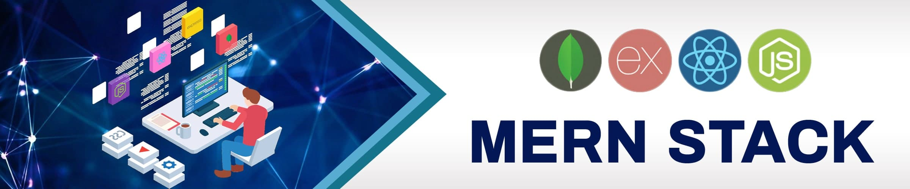

<h1 align="center">👋 Hi, I'm Saad Khan</h1>

  

  
  
  

---

## 🌟 About Me

I am a passionate and dedicated MERN Stack Developer. With a strong foundation in both front-end and back-end technologies, I specialize in building dynamic and responsive web applications. I also have experience in developing mobile applications. My goal is to deliver high-quality and efficient solutions that provide an excellent user experience.

- 👀 I’m interested in full stack web development, mobile app development, and exploring new technologies.
- 🌱 I’m currently learning advanced Node.js and exploring serverless architecture.
- 💞️ I’m looking to collaborate on open-source projects and innovative web applications.
- 📫 How to reach me: saadk738@example.com
- 😄 Pronouns: He/Him
- ⚡ Fun fact: I love playing chess and coding challenges.

## 🛠️ Tech Stack

### Front-End

### Back-End

### Other Tools

---

## 📈 GitHub Stats

  
  

---

## 🏆 Achievements
- Developed a full-featured e-commerce web application using the MERN stack.
- Contributed to several open-source projects.
- Regularly write and share technical articles on [Dev.to](https://dev.to/saadk738).

---

## 📫 Contact Me

Feel free to reach out to me for any project collaborations or just to connect!

  
  
  

